# Table of Contents

1. [Auto Scaling Group (ASG)](#m1)
2. [Profile](#m2)
3. [Elastic Map Reduce](#m3)
4. [Dashboard](#m4)
5. [Manage](#m5)

<a name = m1>
  
# Auto Scaling Group (ASG)
</a>
Auto Scaling Groups in AWS help scale compute capacity based on pre-set scaling criteria. Creating Auto Scaling Groups using Insisive Cloud is a two step process. Firstly, you have to create a Launch Template within Insisive Cloud. Once you create a Launch Template, you can easily create as many Auto Scaling Groups ( ASGs) as needed with a few clicks.  

## Launch Templates

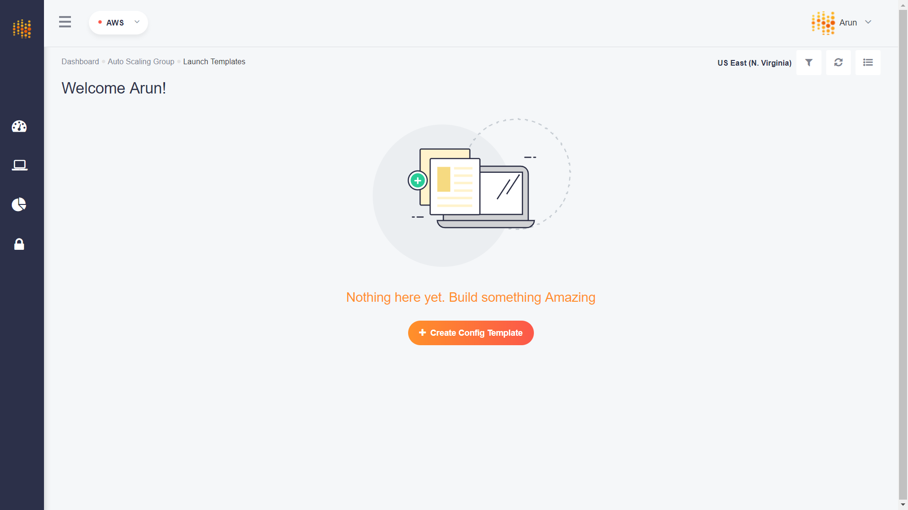

Navigate to Launch Templates using 'Auto Scaling Group' -> 'Launch Templates'.Initially it will be empty.

### Selecting Region(s)

The region defaults to 'US East(N. Virginia)'. This can be changed using the Filter icon next to the region name. You can choose a specific region or hit 'Clear' to clear region. Once cleared, it will display launch templates for all regions.
Initially, there will be no Launch Templates. Create a Launch Template using 'Create Config Template' button. There is a refresh button to fetch the list of latest Launch Templates. You can also toggle the view between Grid View and List View.

### Intended Use

You can use Launch Templates to create pre set configurations e.g. Dev , Test, API server etc. You can then create an Auto Scaling group using the templates quickly with a few clicks.

## Create Launch Template

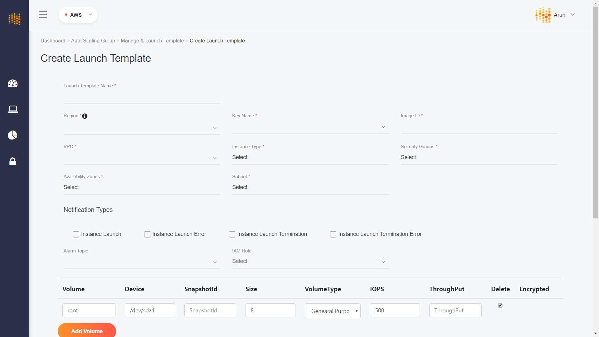

1. Enter a name for the Launch Template
2. Select AWS Region using the drop down. Once the region is selected, wait for corresponding details to be loaded
3. Select Key Name from the drop down
4. Select Image Id from drop down. The drop down will only list private AMIs. For public AMIs, directly input the AMI ID in the edit box
5. Select VPC from the drop down
6. Select Instance Type(s) from the drop down. Selecting multiple instance types increases odds of higher spot instance availability.
7. Select Security Groups
8. Select Availability Zones corresponding to the region selected
9. Select Sub net corresponding to the region and Availability zone.
  * Please Note that the VPC and AZ need to be selected before selecting subnet. Else, the subnet drop down will not be populated
10.Select Notification Type for ASG scaling actions. This is an optional action. If you select a notification type, then you need to select the Alarm Topic mandatorily.
11.Select IAM Role to be used while launching EC2 Instance.
  * Selecting IAM Role is considered a best practice from security perspective *
12.Select the volume attributes based on the ImageID selected. 
  * Especially note the size of root volume and Device ID . 
These are based on AMI size and if AMI is HVM / PV. The Device ID for some AMIs is /dev/xvda and some AMIs it is /dev/sd1. 
Choose the appropriate device ID name based on the AMI . 
  * It is considered a best practice to keep the root volume of small size and add additional EBS volumes with larger size. This will also help in creating AMIs quickly in the event of spot termination 
13.Add Additional EBS volumes as per requirement
14.Enter UserData or drag and drop the file containing the commands if applicable
15.Add Tags applicable for the ASG. 
  * The tags will be applied to all the ASGs that use the template 
16.Save the template.
17. If the template is created for the same region that is selected in the Launch Template Overview page, it will appear on the page. Else, you can change the region ( or clear the region ) to view the Launch Templates from all regions.

### Launch Template Overview

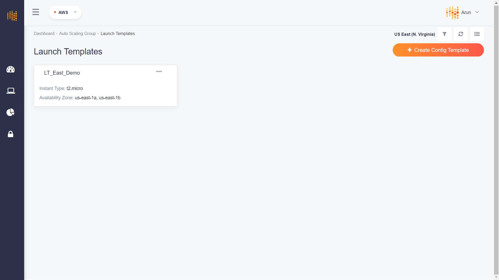

Once the template is created, it is visible in the Launch Templates section of Insisive Cloud

### Edit/Delete Launch Template

You can Edit / Delete Launch Template using the '...' in the grid mode or using the Edit / Delete icons in the list mode.

### Create Auto Scaling Group using Launch Template

In the Grid View mode, you can launch an Auto Scaling group directly using the Launch Template using the 'Create Auto Scaling Group' menu option of the  menu group - '...' for the launch template

## Auto Scaling Group - Overview

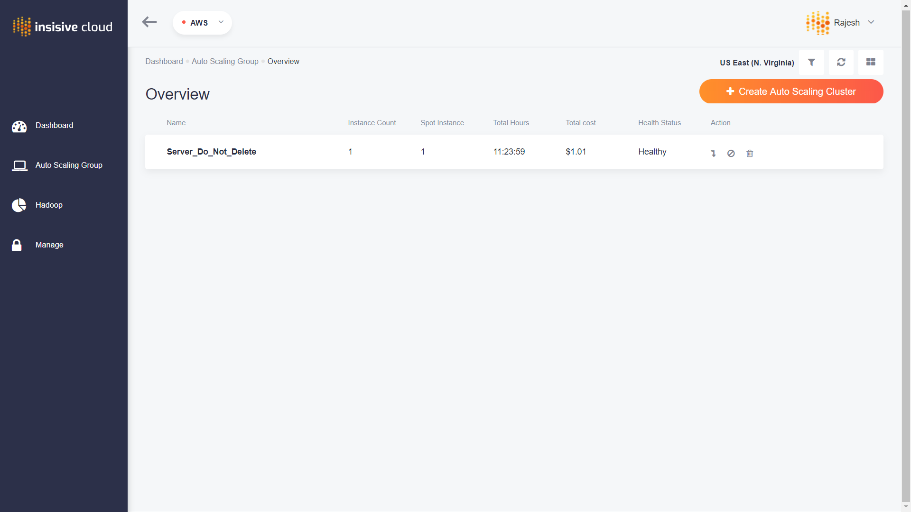

The Overview Page displays the Auto Scaling Groups that are part of the AWS Account. This includes Auto Scaling Groups provisioned via Insisive Cloud as well as Auto Scaling Groups that are created directly via AWS Console or other means.

If an Auto scaling group is not provisioned via Insisive Cloud, it should first be 'Imported' to be monitored and provisioned via Insisive Cloud. This can be done via 'Import' of the context menu of the Auto Scaling Group.

### Create Auto Scaling Group

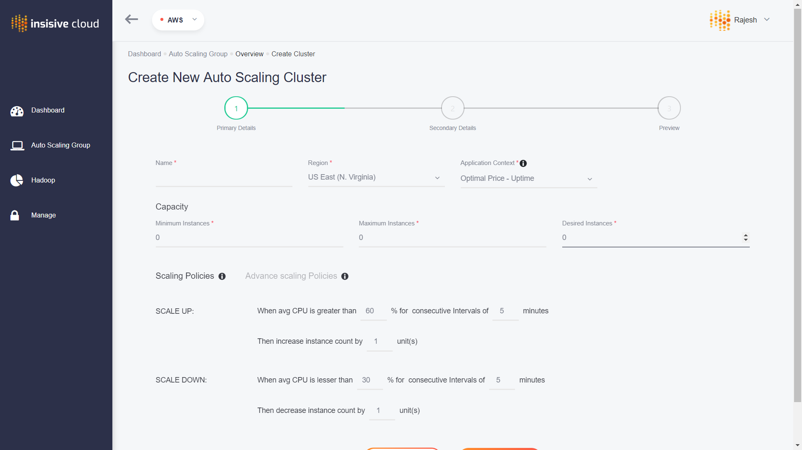

A new Cluster can be created using 'Create Auto Scaling Group' button. You can select the region for the Auto Scaling Group. The 'Application Context' plays an important part in choosing the price and availability charatectistcs of the Auto Scaling Group

#### Application Context

Application Context provides indication about the criticality of the cluster and whether it should be optimized for availability for Cost / Availabilty. Currently it supports the following options

1. Minimum Price : Choose this option for non critical or short duration clusters. This indicates that the cluster can be prioritized for using the lowest price among the selected instance type(s) and there is no minimum number of instances provisioned using On-Demand Instances. The instance life cycle management applies to this so as to monitor and replace instances if there are any interruptions.
e.g. Dev or Test clusters that do not have critical data written at a frequency of greater than once every few seconds. ASG for Staging to verify or reproduce issues with production settings for a short duration and spin it down once the work is completed. 

2. Optimum Price - Uptime : Choose this option for applications that need optimal mix of cost and uptime. This is the default option. This provisions a minumum number of instances in OnDemand at all times and the rest as spot/ondemand based on availability. The algorithm prefers higher available instance type(s) over price until a certain percentage. 
The instance life cycle management applies to this so as it monitor and replace instances if there are any interruptions.
e.g. Long running Dev/Test/Staging Clusters for all types of workloads. Choosing this for Production clusters is suitable for stateless workloads. It is not suitable for production clusters if the stateless requests typically take 120 seconds or more.

3. Maximum Availability : Choose this option if you want to prioritize availability and reduce frequency of interruptions even if cost savings are less than optimal. This provisions a higher number of ondemand instances( ** but not all instances are OnDemand Instances**) and prefers instance types with higher availability even if they are more expensive. This is suitable for all production workloads that are stateless / content driven. Not suitable for workloads which have high frequency disk persisted storage or workloads that take stateless actions that go beyond 120 seconds.

#### Scaling Policies

The scaling policies help scale the ASG in response to increased load. The default values are populated as per best practice. These can be customized as per application specific requirements. Advanced scaling policies can be added as JSON in the Cloudformation compliant Scaling Policies.

#### Secondary Details

The Secondary details page captures additional details on which launch template and other information

#### Load Balancer Type

Choose the application Load Balancer or Target Group that is routing the requests to this ASG(s). 

Note : Choosing Optimum Price - Availability or Maximum Availability will create two or more ASGs. For this, you would need a load balancer or a Target group to serve the requests to multiple ASGs.

#### Health Check Interval

Default time for health check of an instance within an Auto Scaling Group. 

#### Collect Metrics

This will enable collecting CloudWatch metrics at 1-minute intervals instead of the default 5 minute interval. Note: There will be an additional charge from AWS for enhanced cloudwatch metrics collection. So enable it only if you need to gather metrics at 1-minute intervals

#### Instance Protection

This will disable termination of instances programatically. This will prevent scale-in for autoscaling groups.

#### Tags

Add any optional tags for better tracking. A few tags are added by default. This includes the Application name, Organisation ID, User Name. This will help to categorize costs per user / Org ID/ Application Name for better cost visibility ( once we enable the tags in Cost Allocation Tags).

#### Preview

Hitting 'Show Preview' navigates to Preview page that shows the preview of information that will be used to provision the autoscaling group with the main elements. Hit 'Create Now' to create the Auto Scaling Group. Based on the application context and instance types selected, please wait for the clusters to be created and all the instances to be provisioned.  

Note : Based on the options selected, you may notice that there are more than one Auto Scaling Groups created in AWS Console - all starting with the same application as given for the given ASG. This is by design. Having more than one ASG is necessary and a best practice when multiple instance types are provided or when a minimum compute capacity is to be available as part of compute pool for the ASG. All the ASGs with the same application name will work in consort and managed by Insisive Cloud seemlessly. 

### Auto Scaling Group - Summary

The Auto Scaling Group Overview page lists the Auto Scaling Group(s) in a particular region. Clicking on a Auto Scaling group open the Auto Scaling Group Summary view.

Summary View consists of an Overview page/ Metrics/ Time Line tabs

#### Overview 

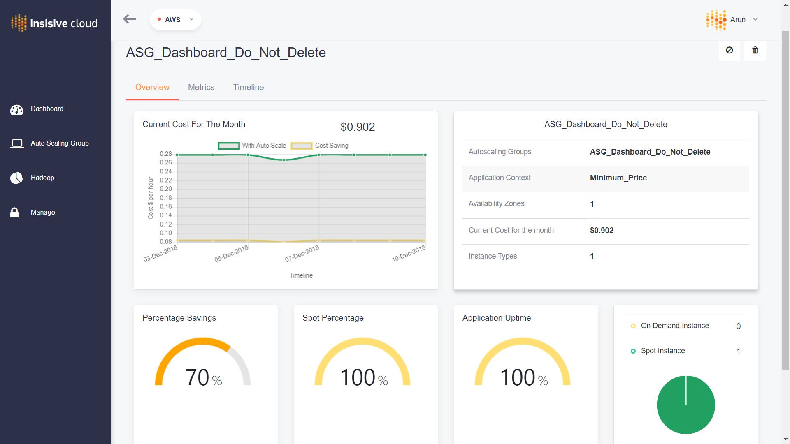

Overview displays the Current Cost for the month. It displays two data series in the chart. The potential cost if Insisive Cloud is not used and actual cost. It also displays other details such as percentage savings over ondemand instances, Percentage of Spot Instances and number of one demand and spot instances. If there are more than one Auto Scaling Groups created, 'Auto Scaling Groups' will display all the grouped Auto scaling Groups.

#### Metrics

The metrics displays a curated list of cloud watch metrics. These when looked at together can give a good indication of any under provisioning or over provisioning of Auto Scaling Group. 
In case of multiple ASGs, there will be multiple data series per chart - one corresponding to each ASG. 

#### Timeline

This shows the instances attached or detatched to the Auto Scaling in response to scaling events , health status or spot termination events.

#### Suspend / Resume

It is possible to suspend / resume the on-demand instances of the cluster if needed. It can be done based on a schedule or immediately. It is accessible from ASG Overview page via the context menu and ASG summary page using the pause or run icon.
**Note : The Spot Instances in the cluster will continue to run even if it is reported that the ASG is suspended. Spot Instances cannot be stopped by user actions currently in AWS. They can only be terminated/hibernated**.

<a name = m2>
  
# Profile
</a>
Profile is accessible via Dashboard -> <User Name> -> Profile.  Profile consists of three tabs
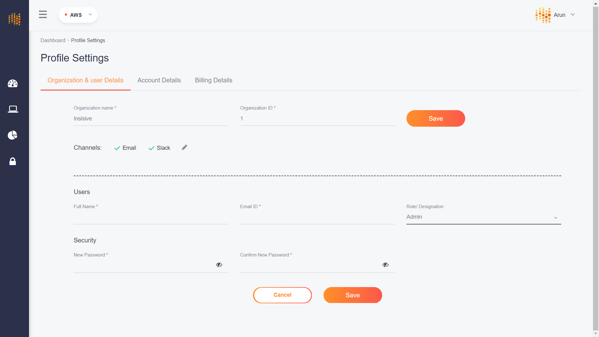

## Organisation & User Details
Organisation Name can be updated. Organisation ID is system generated and cannot be updated.
### Channels
Select the channels to be used to be notified for any provisioning events. The currently available channels are Email and Slack
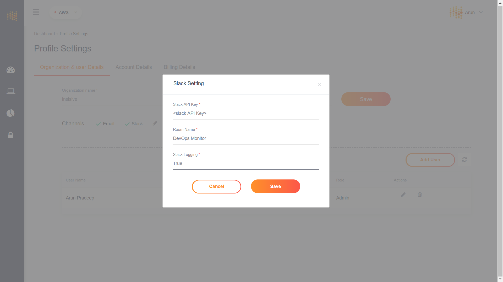
#### Slack
Edit the Slack setting to input the Slack channel details 
1. Slack API Key - Your organisation's Slack API key 
2. Room Name - The room that you want the notifications to be posted to. 
3. Slack Logging - The logging level for Slack event notifications - The valid values are Info, Debug, Error, Critical
### Users
By default, the initial email id used for signup is the only user for the organisation. You can add more users to the system with the 'Add User' option
#### Add User
Add user takes Full Name, Email ID,  Role ( Currently only Admin role is supported), Password and Confirm Password. Hit 'Save' to create a new user for the organisation.
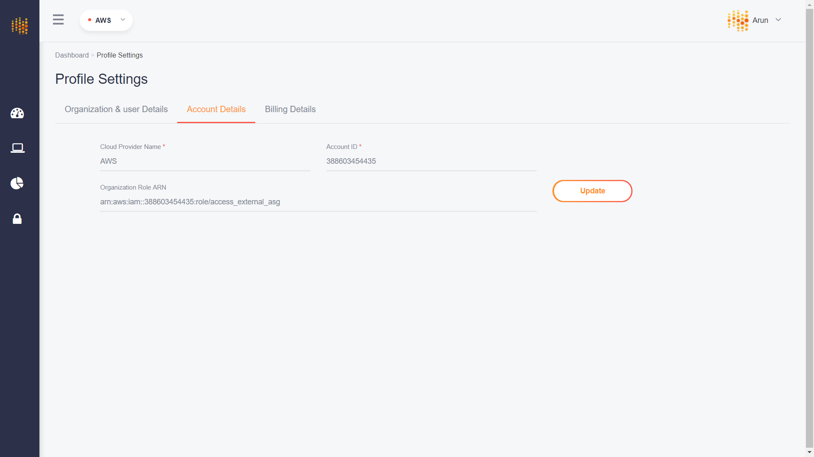
## Account Details
The Account Details tab shows current Cloud provider, Account ID for the provider and the organisational Role ARN that was provided during signup. The Role ARN can be updated based on any changes to service level access and updated after signup as well
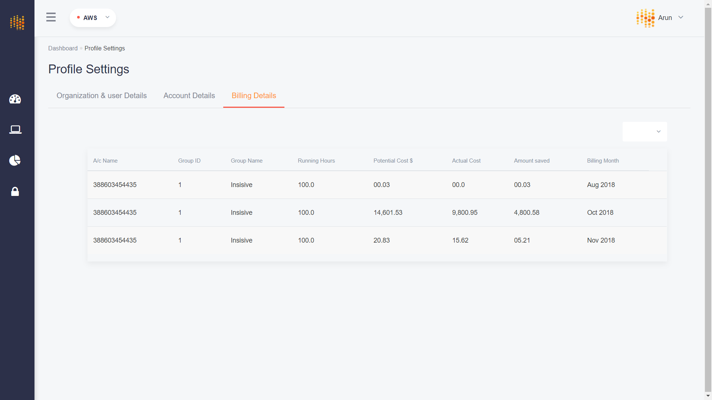
## Billing Details
Billing Details shows the summary of AWS costs incurred for the month for the services provisioned via Insisive Cloud. This shows the Account ID , organisation Name , Running hours of all the instances together, Potential Cost - Cost that would be incurred if Insisive Cloud was not used, Actual Cost - Actual cost of resources incurred for the services provisioned via Insisive Cloud, the savings obtained
### Points to Ponder
1. The cost is for EC2 instances provisioned only. It does not include other related costs such as Data Transfer, API costs, Storage costs.
2. The costs are calculated every hour. If any instances are created in between and stopped before the next cycle, the costs/savings of those instances are not included. The frquency of calculation of costs/savings will change without notice. We trust our Customers will work in good faith and do not attempt to game the system.
3.The costs of EC2 instances is obtained via AWS API. In some flavors of linux e.g. SUSE Linux, some of the pricing details are currently not available via AWS API. In these cases, the cost obtained defaults to the default Linux. Consequently the cost/saving would be slightly different per hour. We are working towards the resolution of the issue.
4. The Actual billing from Insisive Cloud will be based on the savings displayed for the month as per the information displayed here along with the plan selected.
5. The Savings displayed is only on the difference between OnDemand and Spot Instances. Reserved Instance Discounts are not considered at this time. Volume discounts and custom AWS pricing are also not considered at this time. We will be adding support for the same shortly

<a name = m3>

# Elastic Map Reduce (EMR)
</a>

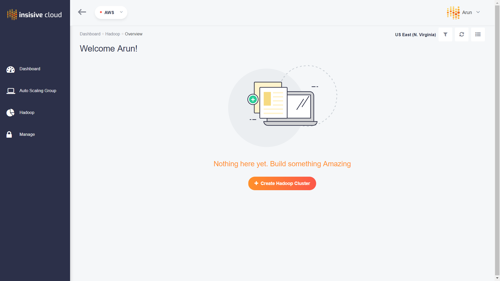

EMR helps in creating managed hadoop clusters. Creating EMR cluster using Insisive Cloud is a two step process. Firstly, you have to create a Launch Template within Insisive Cloud. Once you create a Launch Template, you can easily create as many EMR Clusters as needed with a single click.  

## Launch Templates

Navigate to Launch Templates using 'Hadoop' -> 'Launch Templates'.

### Selecting Region(s)

The region defaults to 'US East(N. Virginia)'. This can be changed using the Filter icon next to the region name. You can choose a specific region or hit 'Clear' to clear region. Once cleared, it will display launch templates for all regions.
Initially, there will be no Launch Templates. Create a Launch Template using 'Create Config Template' button. There is a refresh button to fetch the list of latest Launch Templates. You can also toggle the view between Grid View and List View.

### Intended Use

You can use Launch Templates to create pre set configurations e.g. Dev , Test, API server etc. You can then create a EMR cluster using the templates quickly with a few clicks.

## Create Launch Template

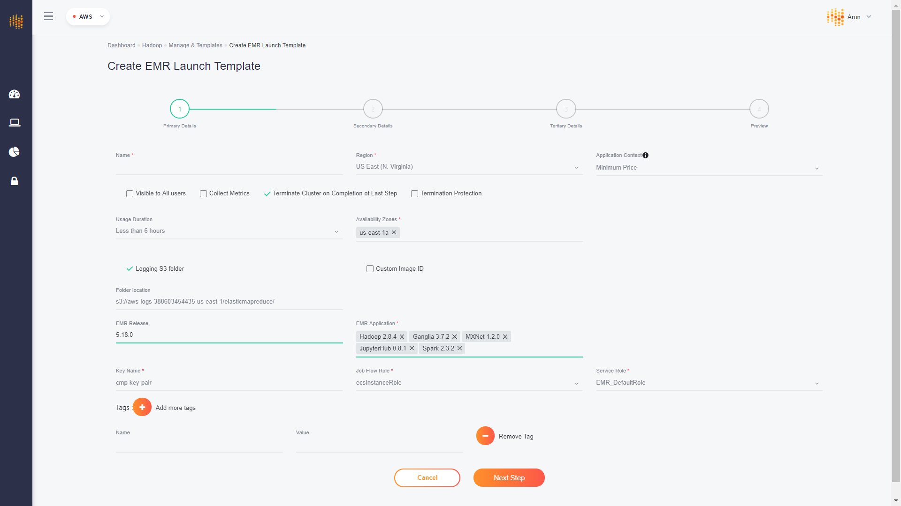

1. Enter a name for the Launch Template
2. Select AWS Region using the drop down. Once the region is selected, wait for corresponding details to be loaded
3. Select Application Context from the drop down
5. Select usage duration of the cluster. Upto 50% of the jobs are completed within 6 hours. If that is the case with you, select the duration as ' Less than 6 hours'. Based on application context,this can result in guarenteed uptime with slightly higher costs than spot but less than on demand for 'Maximize Availability' option .

6. Select 'Availability Zone'. EMR usually runs in only one AZ but based on provisioning , in some cases, EMR may be provisioned across multiple AZ. Choosing multiple AZ will give greater flexibility in this case.
7. Select Security Groups
8. Select Availability Zones corresponding to the region selected. The corresponding subnet for the default vpc will be selected automatically.  
9.Select Job Flow role and Service  to be used while launching EMR cluster. * Selecting IAM Role is considered a best practice from security perspective *
10. Add Tags that are relevant to the launch template.These will be applied to all the EMR clusters created using this Launch Template.

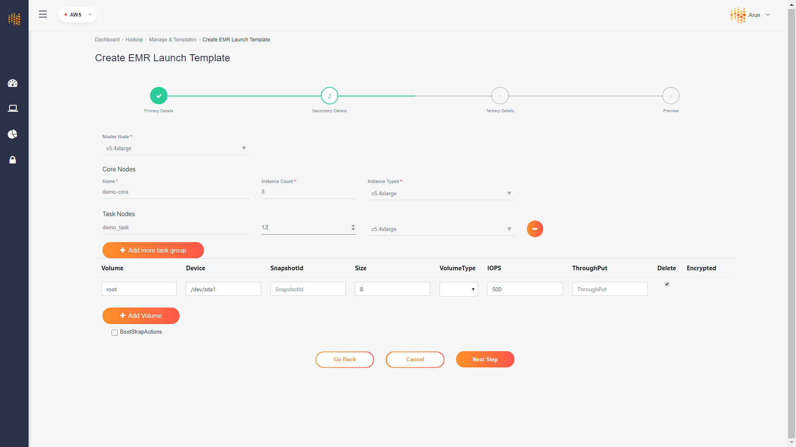
11. Select Master Node instance type, Core Node Instance Type and Task Node instance types. Add more task groups if needed.
12.Select the volume attributes based on the ImageID selected. 
  * Especially note the size of root volume and Device ID 
  * These are based on AMI size and if AMI is HVM / PV. The Device ID for some AMIs is /dev/xvda and some AMIs it is /dev/sd1.  Choose     the appropriate device ID name based on the AMI . 
  * It is considered a best practice to keep the root volume of small size and add additional EBS volumes with larger size. This will       also help in creating AMIs quickly in the event of spot termination 
13.Add Additional EBS volumes as per requirement
14.Select BootStrap actions that need to be executed on the nodes when they are created - if applicable. Go to next screen for adding steps to the EMR Clusters
15. Add custom step to the EMR cluster as needed

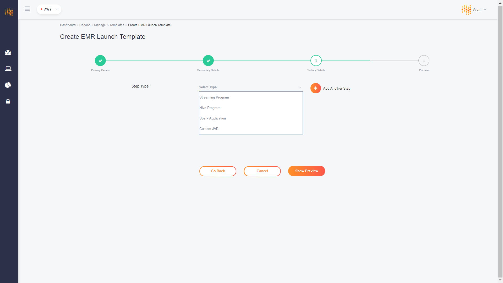
16. Select appropriate steps to add to the cluster
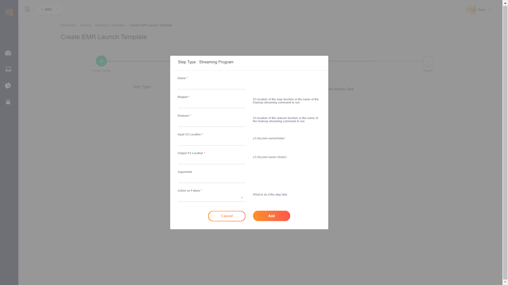
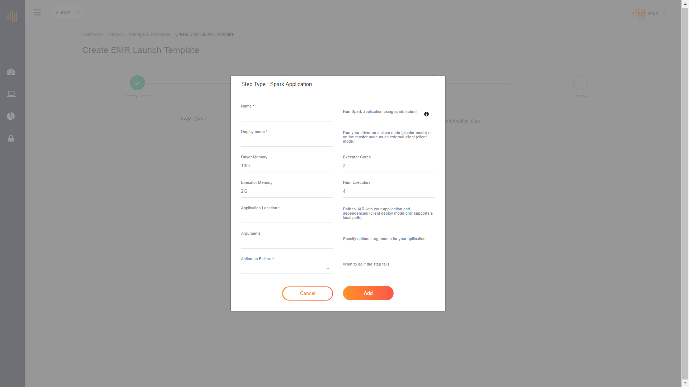
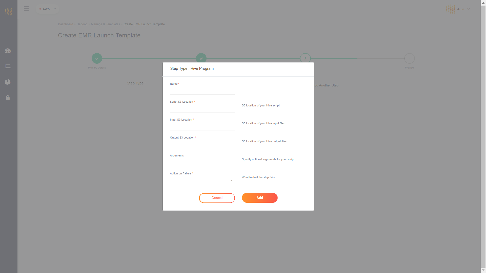
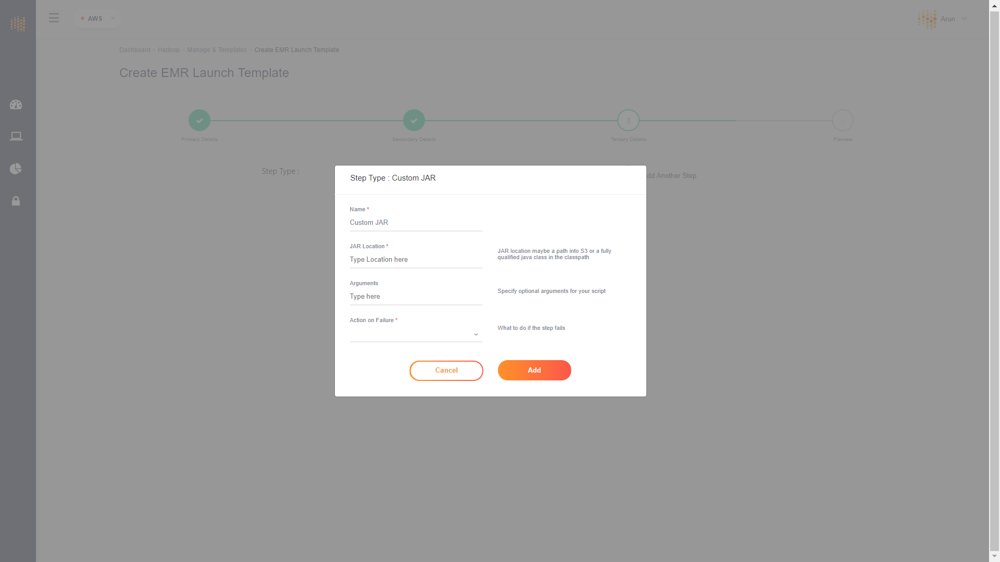
17.Save the template.
18. If the template is created for the same region that is selected in the Launch Template Overview page, it will appear on the page. Else, you can change the region ( or clear the region ) to view the Launch Templates from all regions.

### Edit/Delete Launch Template

You can Edit / Delete Launch Template using the '...' in the grid mode or using the Edit / Delete icons in the list mode.

### Create EMR using Launch Template

In the Grid View mode, you can launch an Auto Scaling group directly using the Launch Template using the 'Create Auto Scaling Group' menu option of the  menu group - '...' for the launch template

## Hadoop - Overview

The Overview Page displays the EMR clusters that are part of the AWS Account. This includes EMR clusters provisioned via Insisive Cloud as well as EMR clusters that are created directly via AWS Console or other means.

If a EMR cluster is not provisioned via Insisive Cloud, It cannot be monitored. Currently, only EMR clusters created via Insisive Cloud are supported

### Running Status and Region Filter

By default the running status filter will show 'Starting', 'Running','Waiting' EMR clusters. Choose other filter options if you wish to see terminated clusters or clusters in 'BootStrapping' state.

Choose the Region to view EMR Clusters in a particular region or clear the region to see clusters in all regions.

### Create EMR Cluster

A new Cluster can be created using 'Create Auto Scaling Group' button. You can select the region for the EMR Cluster. The 'Application Context' plays an important part in choosing the price and availability charatectistcs of the Auto Scaling Group

#### Region

Select the region where the EMR cluster is to be created. This will populate other relevant drop downs like Launch Template,Availability Zones, EMR Release, Key Name.

#### EMR Application

Selecting an EMR Release will populate EMR Applications drop down. Choose relevant EMR Applications from the EMR Release.

### Custom Image ID

Choose the tick box if you wish to deploy a custom image

#### S3 folder location

Enter the S3 location where you would like the logs of EMR to be stored - if the 'Logging to S3 Folder' option is selected.

#### Application Context

Application Context provides indication about the criticality of the cluster and whether it should be optimized for availability for Cost / Availabilty. Currently it supports the following options

1. Minimum Price : Choose this option for non critical or short duration clusters. This indicates that the cluster can be prioritized for the using the lowest price among the selected instance type(s) and there is no minimum number of instances provisioned using On-Demand Instances. The instance life cycle management applies to this so as it monitor and replace instances if there are any interruptions.
e.g. Dev or Test clusters that do not have critical data written at a frequency of greater than once every few seconds. ASG for Staging to verify or reproduce issues with production settings for a short duration and spin it down once the work is completed. 

2. Optimum Price - Uptime : Choose this option for applications that need optimal mix of cost and uptime. This is the default option. This provisions a minumum number of instances in OnDemand at all times and the rest as spot/ondemand based on availability. The algorithm prefers higher available instance type(s) over price until a certain percentage. 
The instance life cycle management applies to this so as it monitor and replace instances if there are any interruptions.
e.g. Long running Dev/Test/Staging Clusters for all types of workloads. Choosing this for Production clusters is suitable for stateless workloads. It is not suitable for production clusters if the stateless requests typically take 120 seconds or more.

3. Maximum Availability : Choose this option if you want to prioritize availability and reduce frequency of interruptions even if cost savings are less than optimal. This provisions a higher number of ondemand instances( ** but not all instances are OnDemand Instances**) and prefers instance types with higher availability even if they are more expensive. This is suitable for all production workloads that are stateless / content driven. Not suitable for workloads which have high frequency disk persisted storage or workloads that take stateless actions that go beyond 120 seconds.

#### EMR Release

Choose the EMR version.

#### Secondary Details

The Secondary details page captures additional details on which launch template and other information

#### Load Balancer Type

Choose the application Load Balancer or Target Group that is routing the requests to this ASG(s).

Note : Choosing Optimum Price - Availability or Maximum Availability will create two or more ASGs. For this, you would need a load balancer or a Target group to serve the requests to multiple ASGs.

#### Health Check Interval

Default time for health check of an instance within an Auto Scaling Group. 

#### Collect Metrics

This will enable collecting CloudWatch metrics at 1-minute intervals instead of the default 5 minute interval. Note: There will be an additional charge from AWS for enhanced cloudwatch metrics collection. So enable it only if you need to gather metrics at 1-minute intervals

#### Tags

Add any optional tags for better tracking. A few tags are added by default. This includes the Application name, Organisation ID, User Name. This will help to categorize costs per user / Org ID/ Application Name for better cost visibility ( once we enable the tags in Cost Allocation Tags).

#### Instance Types

Choose the Instance Types for Master Node, Core Node and Tertiary Nodes. Optionally, add additional Task nodes. 

#### Volume and Bootstrap actions

Add custom volumes an bootstrap actions as needed. 

#### Custom Steps

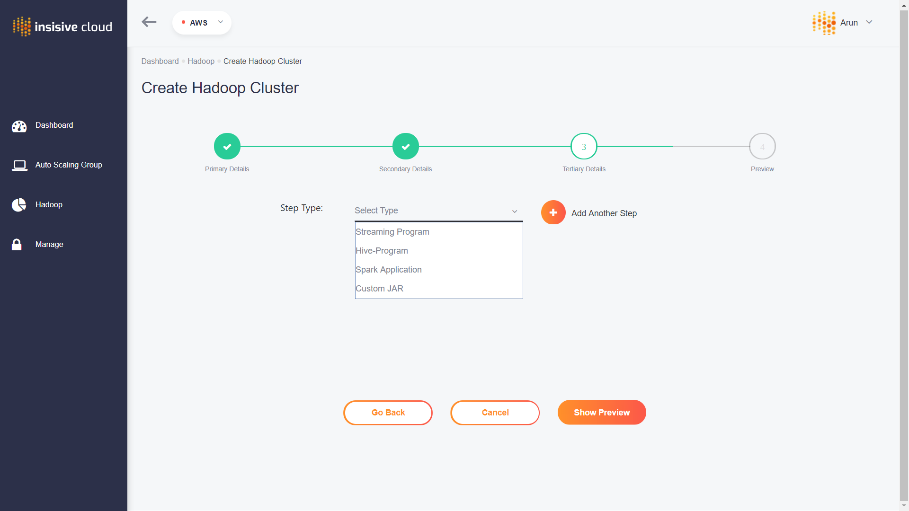

Insisive cloud supports 'Custom Jar' , 'Hive Program' , 'Spark Program' , 'Streaming Program' as custom steps.

#### Preview

Hitting 'Show Preview' navigates to Preview page that shows the preview of information that will be used to provision the autoscaling group with the main elements . Hit 'Create Now' to create the Auto SCaling Group. Based on the application context and instance types selected, please wait for the clusters to be created and all the instances to be provisioned.  

Note : Based on the options selected, you may notice that there are more than one Auto Scaling Groups created in AWS Console - all starting with the same application as given for the given ASG. This is by design. Having more than one ASG is necessary and a best practice when multiple instance types are provided or when a minimum compute capacity is to be available as part of compute pool for the ASG. All the ASGs with the same application name will work in consort and managed by Insisive Cloud seemlessly. 

### EMR - Summary

The Hadoop Overview page lists the EMR clusters in a particular region. Clicking on a EMR cluster opens the EMR cluster Summary view.

Summary View consists of an Overview page/ Metrics/ Time Line tabs

#### Overview

Overview displays the Current Cost for the month. It displays two data series in the chart. The potential cost if Insisive Cloud isnt used and actual cost. It also displays other details such as percentage savings over ondemand instances, Percentage of Spot Instances and number of one demand and spot instances.

#### Metrics

The metrics displays a curated list of cloud watch metrics. These when looked together can give a good indication of any under provisioning or over provisioning of Auto Scaling Group.

EMR does not support Suspend/Resume. In case a cluster is not needed, please terminate the cluster using the 'Delete' Icon. 

<a name = m4>

# Dashboard
</a>
Dashboard provides a quick summary of savings for the Auto Scaling Groups and EMR Clusters provisioned via Insisive Cloud for a specified duration( e.g. Last Week, Last Month, Last year). The Profile section is also accessible from the Dashboard. 

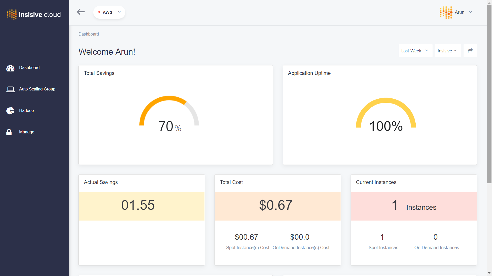

## Total Savings ( Percentage)

This is the total savings on the resources provisioned by Insisive Cloud. This is updated every hour.

## Application Uptime

This is the uptime for the applications for the specified duration taking into account any loss in capacity due to spot interruptions.

## Actual Savings

The absolute savings in USD for the total savings for the Auto Scaling Groups and EMR clusters provisioned via Insisive Cloud

## Total Cost

The total cost of the resources provisioned via Insisive Cloud during the specified period. This is in USD.The cost of Spot Instances and OnDemand Instances is listed seperately. Please note that the actual can be more than the combined cost of Spot and OnDemand Instances taking into account the cost of EMR, Data transfer etc.

## Current Instances

Number of Instances that are provisioned via Insisive Cloud for ASG and EMR clusters.Also shows the number of On-Demand and Spot Instances in ASGs and EMR Clusters.

## Export

The dashboard can be exported as PDF using the Export Icon on the dashboard

## Profile/ Log out

Clicking on the User Name displays the Profile / Log out  Menu items

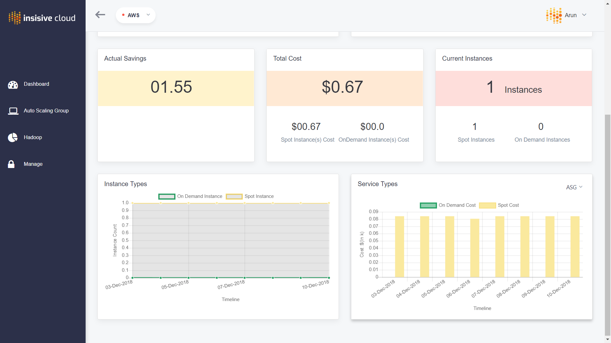

## Instance Types

The Instance Types Graph displays the number of spot / On demand Instances provisioned via Insisive Cloud over the given duration ( Last Week/Last Month/ Last Year) for the selected account.

## Service Types

The Service Types Graph displays the total AWS cost incurred for the Services provisioned via Insisive Cloud for the given period. Currently it displays Auto Scaling Group ( ASG ) and EMR Costs.

<a name = m5>
  
# Manage
</a>

## Table of Contents

### Cost Policies

1.  [OLD AMIs](#1)
2.  [Old Snapahots](#2)
3.  [Idle EC2 for 3 days](#3)
4.  [Detached Elastic IPs](#4)
5.  [EC2 with No Network Activity](#5)
6.  [EMR across Multiple AZs](#6)
7.  [Public S3 Bucket](#7)
8.  [S3 VPC EndPoint](#8)
9.  [UnderUtilized EC2 Instance](#9)
10. [Unused EBS](#a)
11. [Unused Load Balancers](#b)
12. [Unused PIOPS Disks](#c)

### Security Policies

#### IAM Policies

1. [AWS Resource Access](#11)
2. [AWS Support Role](#12)
3. [Access Keys 90 day Rotation](#13)
4. [Access Keys for Console Access Users](#14)
5. [Active IAM Master/Manager ](#15)
7. [Avoid Root account](#16)
8. [Current Contact Info](#17)
9. [Disable Unused Credentials](#18)
10. [Enable Detailed Billing](#19)
11. [Hardware MFA Enabled ](#20)
12. [IAM Group Policy](#21)
13. [IAM Password Policy 90 days](#22)
14. [IAM Policy groups/roles](#23)
15. [MFA Enabled](#24)
16. [Minimum 1 LowerCase letter in password](#25)
17. [Minimum 1 Number](#26)
18. [Minimum 1 Symbol ](#27)
19. [Minimum 1 UpperCase letter in password ](#28)
20. [Minimum Password Length ](#29)
21. [Password Reuse](#30)
22. [Root MFA Enabled](#31)
23. [Root access key](#32)
24. [SNS Topic Subscribers](#33)
25. [Security Contact Info ](#34)

#### Monitoring Policies

1.  [AWS Auth Failure](#35)
2.  [AWS Config Change](#36)
3.  [Alarm for UnAuthorized API calls](#37)
4.  [CMKs Deletion/Disable](#38)
5.  [CloudTrail Config Change](#39)
6.  [MFA Console SignIn](#40)
7.  [NACL Change](#41)
8.  [Network Gateway Change](#42)
9.  [Root Account Alarm](#43)
10. [Route Table Change](#44)
11. [S3 Policy Change](#45)
12. [Security Group Change](#46)
13. [VPC Change](#47)
14. [IAM Policy Change](#48)

#### Audit Policies

1.  [AWS Config Enabled](#49)
2.  [Cloud Trail integration of CloudWatch Logs ](#50)
3.  [CloudTrail Enabled](#51)
4.  [CloudTrail Encrypted](#52)
5.  [CloudTrail Log File Validation](#53)
6.  [CloudTrail Public Access](#54)
7.  [No SSE/KMS Encryption for S3](#55)
8.  [Public EC2 Instance](#56)
9.  [Rotation of customer CMKs Enabled](#57)
10. [S3 Bucket Access](#58)

#### Networking Policies

1. [RDP not Allowed from Everywhere](#59)
2. [SSH not Allowed from Everywhere](#60)
3. [VPC Flow Logging Enabled](#61)
4. [VPC Peering with Least Access](#62)
5. [VPC Traffic Restriction of Security Group](#63)
  
  
# Skeleton of a Policy

## Rule Description
* This section gives you a general idea of the aforementioned rule and tells you why it should be adhered to.

### Results Tab 
* This consists of all the Failed Resources, Ignored Resources, and the possible fixes available.
            
### Filter Tab
* This consists of a set of options that can be used to filter out the resources for which the rule should apply. If the options           are not set, by default, all resources which fail to comply to the rule will appear. 
            
### Action Tab
* Once marked, you can choose to undertake a specific action such as 'Stop', 'Delete', etc, after a resource repeatedly fails a           rule over a user specified period of time.

Consider the following illustration of the Public S3 Bucket rule,

## Rule Description 

An S3 Bucket when made public is automatically vulnerable to security breaches. Apart from this, you will be billed by AWS for           every download from a bucket. If there is an unprecedented amount of traffic due to some malicious attack it will quickly become         expensive. Hence, a bucket with public permissions should be made private. 

## Results Tab 

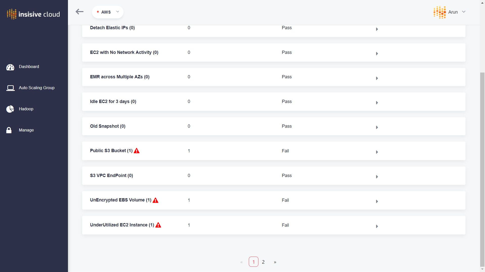

* Here, the Failed Resources section contains a list of all the Public S3 Buckets present. 
* The Ignore Resources section gives you the option of bypassing the rule for few or all resources. 
* This can be done by selecting the resource(s), and then clicking on Ignore All/ Ignore Selected. 
* On doing this, you can see that the selected resource(s) are now present in the Ignore Resources section.
* If you want to revert this action you can select the Revoke/ Revoke All option. (ask)
* If an automated fix is not available, you can follow the steps provided in 'how to fix'. 

## Filter Tab

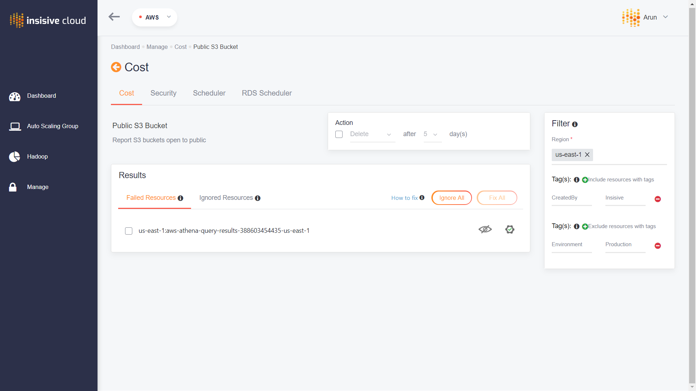

* Filters can be used to apply the rule to S3 Buckets over only specfic regions.
* This can be done by specifying the Region.
* You can go one step further by specifying the tag(s) of the resource(s) in the 'Inlcude resources with tags' option.
* Once this is done, only the tagged resource(s) will be picked up.
* The same goes for explicitly excluding a resource by specifying the tag(s) of the resource(s) in the 'Exclude resources with             tags' option.
* Once this is done the tagged resource(s) will not be picked up.

## Action Tab

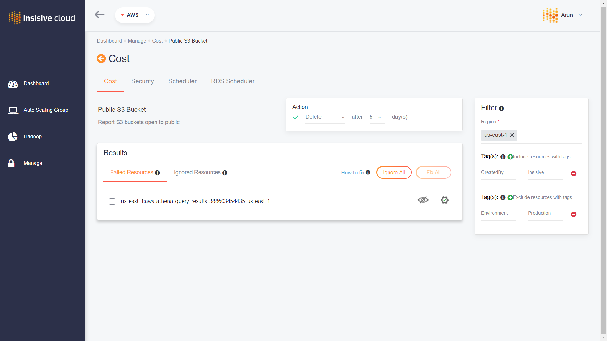

* On marking the Action tab you can choose to automate an action such as Delete, Stop, etc, for the failing resources after a             user specified period of time. 

#### NOTE :

1. Initally, when your account is created none of the policies will be failing, after one cycle ie, the next day you will be able to 
   the failing resources.
2. Similarly, the applied changes to policies will be updated during the next cycle.
3. The actions present in the actions tab are irrevocable.

# List of Cost Policies
<a name="1">
  
## Old AMIs

</a>

  EBS backed AMIs are charged for the EBS volumes along with the EBS Snapahots. S3 backed AMIs are charged for the S3 storage.
  Hence, old AMIs should ideally be deregistered to avoid these costs.

  ### Action

  * DEREGISTER : Deregisters the old AMI(s).

<a name="2">

## Old Snapahots

</a>

It is advisible to not keep Snapshots older than 10 days due to the incurred cost that comes along with it.

### Action

* DELETE : Deletes Snapahots older than 10 days.

<a name="3">

## Idle EC2 for 3 days

</a>

EC2 instances that are running but have a CPU utilization of less than 2% over a period of 72 hours are considered to be                 idle EC2 instances.

### Action

* STOP : Stops the idle EC2 instances.
* TERMINATE : Terminates the idle EC2 instances. 
  
 <a name="4">

## Detached Elastic IPs

</a>

  

  AWS enforces an hourly charge if an Elastic IP (EIP) address within your account is not associated with a running EC2                   instance or an Elastic Network Interface (ENI).

  ### Action

  * No action available yet.

     <a name="5">

## EC2 with No Network Activity

</a>

  EC2 instances where the data being sent or recieved is less than 128Kbs over a period of 5 days is considered to have no                 network activity.

  ### Action

  * STOP : Stops the idle EC2 instances. 
  * TERMINATE : Terminates the idle EC2 instances.
  
<a name="6">

## EMR across Multiple AZs

</a>

  There are costs incurred when data is being sent from one availablity zone to another, hence it is advisible to not have EMR             clusters that span over multiple AZs.

  ### Action

  * No action available yet.
  
 <a name="7">
          
## Public S3 Bucket

</a>

  An S3 Bucket when made public is automatically vulnerable to security breaches. Apart from this, you will be billed by AWS               for every download from a bucket. If there is an unprecedented amount of traffic due to some malicious attack it will                   quickly become expensive. Hence, a bucket with public permissions should be made private. 

            
  ### Action

  * DELETE : Deletes the public S3 Buckets.
  
 <a name="8">

## S3 VPC EndPoint

</a>

  A VPC endpoint enables you to privately connect your VPC to your S3 Bucket without requiring an internet gateway, NAT                   device, VPN connection, or AWS Direct Connect connection. Instances in your VPC do not require public IP addresses to                   communicate with resources in the service. Traffic between your VPC and the other service does not leave the Amazon network.             As there are charges associated with internet gateways etc, this is a better and safer option.

  ### Action

  * No action available yet.
  
 <a name="9">

## UnderUtilized EC2 Instance

</a>

  When an EC2 Instance has a CPU utlilization of less than 10% it is considered to be underutilized.

  ### Action

  * STOP : Stops the underutilized EC2 instances. 
  * TERMINATE : Terminates the underutilized EC2 instances.  
  
 <a name="a">

## Unused EBS

</a>

  Elastic Block Stores that are provisioned but unattached to any instances or are underutilized incur some cost and hence                 should be deleted when unused.

  ### Action

  * DELETE : Deletes the unused EBS.
  
 <a name="b">

## Unused Load Balancers

</a>

  Load Balancers with zero connections(unused) but in active state are still billed for by AWS. 

  ### Action

  * DELETE : Deletes the unused Load Balancers.
  
 <a name="c">

## Unused PIOPS Disks

</a> 

  Provisioned IOPS disks that are not attached to any resources such as EC2, RDS, etc or are underutilized are still billed               for by AWS.

  ### Action

  * TERMINATE : Terminates the unused Provisioned IOPS Disks

# List of Security Policies 

## IAM POLICIES

<a name="11">

### AWS Resource Access 
  
 </a>

  Ensure IAM instance roles are used for AWS resource access from instances.
  
<a name="12">
 
### AWS Support Role

</a>

  A support role should be created so as to manage incidents with the AWS support.
  
<a name="13">

### Access Keys 90 day Rotation 

</a>

Changing access keys (which consist of an access key ID and a secret access key) on a regular schedule is a well-known                   security best practice because it shortens the period an access key is active and therefore reduces the business impact if               they are compromised.

<a name="14">

### Access Keys for Console Access Users
</a>

Do not set up access keys during inital user setup for all IAM users that have console password.

<a name="15">

### Active IAM Master/Manager 
</a>

IAM Master/Manager roles should be active in order to effectively manage user permissions for all levels of your                         organisation.

<a name="16">

### Avoid Root account

</a>
We strongly recommend that you do not use the root user for your everyday tasks, even the administrative ones. Instead,                 adhere to the best practice of using the root user only to create your first IAM user. Then securely lock away the root user             credentials and use them to perform only a few account and service management tasks.

<a name="17">

### Current Contact Info 
</a>

Ensure your contact information is current.

<a name="18">

### Disable Unused Credentials 
</a>

Ensure that credentials unused for more than 90 days are disabled.

<a name="19">

### Enable Detailed Billing

</a>

To have a better idea about the breakup details of your spend ensure detailed billing is activated.

<a name="20">

### Hardware MFA Enabled 

</a>

Ensure hardware mutlifactor authorisation is enabled. Without multi-factor authentication (MFA), antivirus software,                     firewalls, encryption technology, and vulnerability tests can be bypassed.

<a name="21">

### IAM Group Policy

</a>
Ensure IAM policies are attached only to groups or roles and not directly to individual users.

<a name="22">

### IAM Password Policy 90 days

</a>

Ensure that the IAM password policy expires within 90 days or less.

<a name="23">

### IAM Policy groups/roles

</a>
Ensures that security questions are registered in the AWS account.

<a name="24">

### MFA Enabled

</a>

Ensure mutlifactor authorisation is enabled for all IAM users that have a console password. Without multi-factor                         authentication (MFA), antivirus software, firewalls, encryption technology, and vulnerability tests can be bypassed.

<a name="25">

### Minimum 1 LowerCase letter in password

</a>

To make your password stronger ensure that it contains a minimun of one lowercase letter.

<a name="26">

### Minimum 1 Number

</a>

To make your password stronger ensure that it contains a minimun of one number.

<a name="27">

### Minimum 1 Symbol 

</a>
To make your password stronger ensure that it contains a minimun of one symbol.

<a name="28">

### Minimum 1 UpperCase letter in password 

</a>

To make your password stronger ensure that it contains a minimun of one uppercase letter.

<a name="29">

### Minimum Password Length 

</a>

To make your password stronger ensure that it contains a minimun of one lowercase letter.

<a name="30">

### Password Reuse

</a>

Ensures IAM policy password prevents password reuse.

<a name="31">

### Root MFA Enabled

</a>

Ensures that mutlifactor authentication is enabled for root user access.

<a name="32">

### Root access key 

</a>

Ensures no root account access key exists.

<a name="33">

### SNS Topic Subscribers

</a>
A topic is a communication channel to send messages and subscribe to notifications. Ensure that the SNS topic Subscribers               are matched appropriately. 

<a name="34">

### Security Contact Info 

</a>
Ensures security contact information is registered.

## MONITORING POLICIES

<a name="35">
  
### AWS Auth Failure 
</a>

Ensures that a log metric filter and alarm exists for AWS management console authentication failures.
<a name="36">

### AWS Config Change
</a>

Ensures that a log metric filter and alarm exists for AWS Config configuration changes.

<a name="37">

### Alarm for UnAuthorized API calls
</a>

Ensures that a log metric filter and alarm exists for unauthorized API calls.
<a name="38">

### CMKs Deletion/Disable
</a>

Ensures that a log metric filter and alarm exists for disabling or scheduled deletion of customer created CMKs.
<a name="39">

### CloudTrail Config Change
</a>

Ensures that a log metric filter and alarm exists for CloudTrail Config Changes.
<a name="48">

### IAM Policy Change
</a>

Ensures that a log metric filter and alarm exists for IAM Policy changes.

<a name="40">
  
### MFA Console SignIn
</a>
Ensures that a log metric filter and alarm exists for management console sign-in without mutlifactor authentication.

<a name="41">

### NACL Change
</a>

Ensures that a log metric filter and alarm exists for changes in Network Access Control List.

<a name="42">

### Network Gateway Change
</a>

Ensures that a log metric filter and alarm exists for changes to Network Gateways.
<a name="43">

### Root Account Alarm
</a>

Ensures that a log metric filter and alarm exists for when there root access occurs.

<a name="44">

### Route Table Change
</a>

Ensures that a log metric filter and alarm exists for when there are changes in the route table.

<a name="45">

### S3 Policy Change
</a>

Ensures that a log metric filter and alarm exists for when there are changes in S3 Bucket policies.

<a name="46">

### Security Group Change
</a>

Ensures that a log metric filter and alarm exists for when there are changes in security groups.

<a name="47">

### VPC Change
</a>
Ensures that a log metric filter and alarm exists for when there are VPC changes.

## AUDIT POLICIES

<a name="49">

### AWS Config Enabled
</a>

AWS Config provides a detailed view of the configuration of AWS resources in your AWS account. This includes how the                     resources are related to one another and how they were configured in the past so that you can see how the configurations and             relationships change over time. By having the AWS Config enabled for all regions it helps in keeping track of growing                   resources present in all regions. 

<a name="50">

### Cloud Trail integration of CloudWatch Logs 
</a>
Cloud Trail tracks user activity and API usage. After you configure CloudTrail integration with CloudWatch Logs, which you               can do from the CloudTrail console or using the AWS SDKs or AWS CLI, CloudTrail begins to continuously and automatically                 deliver all the CloudTrail events associated with API activity to a CloudWatch Logs log group you specify. 

<a name="51">

### CloudTrail Enabled
</a>
CloudTrail trails should be active for all regions so that it is able to pick up the user activity and the API usage in all             regions for that specfifc trial.

<a name="52">

### CloudTrail Encrypted
</a>

CloudTrail logs should be encrypted at rest so that it stays protected even if it falls into the wrong hands.

<a name="53">

### CloudTrail Log File Validation
</a>

Ensures that CloudTrail log file validation has been enabled.

<a name="54">

### CloudTrail Public Access
</a>

Ensures that S3 bucket cloudtrail logs are not publically accessible.

<a name="55">

### No SSE/KMS Encryption for S3 
</a>

Reports S3 Buckets without SSE/KMS encryption. 

  #### Actions 

  * DELETE : Deletes the reported S3 Buckets.

<a name="56">

### Public EC2 Instance 
</a>

Reports EC2 instances with public ip addresses.

  #### Actions

  * STOP : Stops the EC2 instance.
  * TERMINATE : Terminates the EC2 instance.

<a name="57">

### Rotation of customer CMKs Enabled

</a>

When you enable automatic key rotation for a customer managed CMK, AWS KMS generates new cryptographic material for the CMK             every year. AWS KMS also saves the CMK's older cryptographic material so it can be used to decrypt data that it encrypted.

<a name="58">

### S3 Bucket Access 

</a>

Ensures S3 Bucket access logging is enabled on the cloudtrail S3 bucket.

## NETWORKING POLICIES

<a name="59">

### RDP not Allowed from Everywhere
</a>

Ensures that no security group has the TCP/UDP port (3389) open to the world.
<a name="60">
  
### SSH not Allowed from Everywhere
</a>

Ensures that no security group has the SSh port (22) open to the world.

<a name="61">
  
### VPC Flow Logging Enabled
</a>

Ensures VPC flow logging is enabled for all VPCs.

<a name="62">

### VPC Peering with Least Access
</a>

Ensures that when VPC peering takes place they have least access while connecting to each other.

<a name="63">

### VPC Traffic Restriction of Security Group 
</a>

Ensures that the default security group of every VPC restricts all traffic.

## EC2 SCHEDULER 

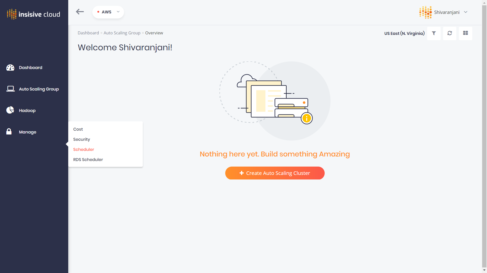

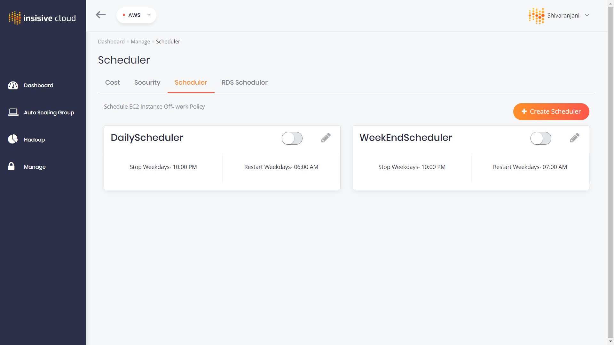

The EC2 scheduler once activated, can be used to stop and restart EC2 instances. For the scheduler to work the following should be specifed :

1. The stop and restart time (default being 10pm and 6am) along with the timezone (default being IST).
2. The regions across which the scheduler should be active.

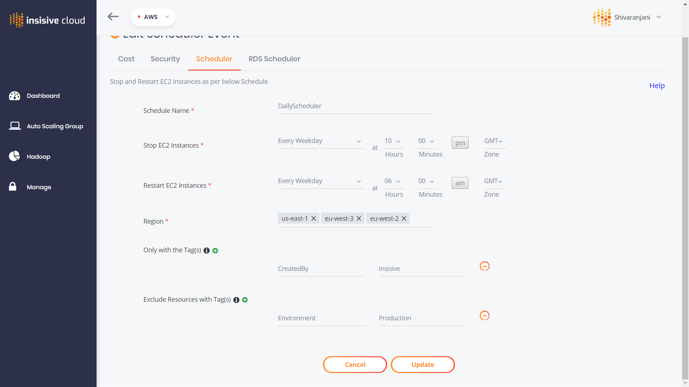

Apart from the above two mandatory requirements, there is an option of including or excluding resources with specific tags available.

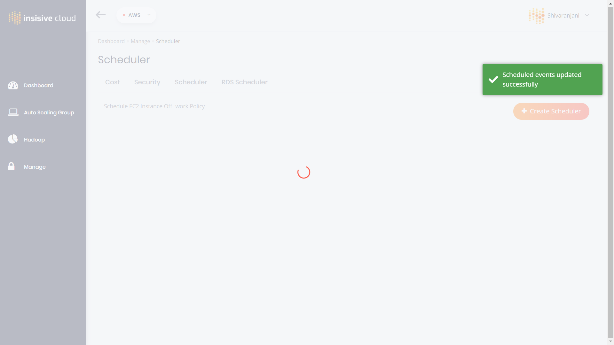

There are three types of schedulers :

Daily scheduler : The daily scheduler is used to stop and restart EC2 instances on a daily basis according to a stipulated time specifed by the user.

Weekend scheduler : Similar to the daily scheduler, this scheduler is used to stop and restart EC2 instances during the weekend.

Customisable scheduler : The customisable scheduler is similar to the above two and n-number of them can be created with varying parameters.

## RDS SCHEDULER 

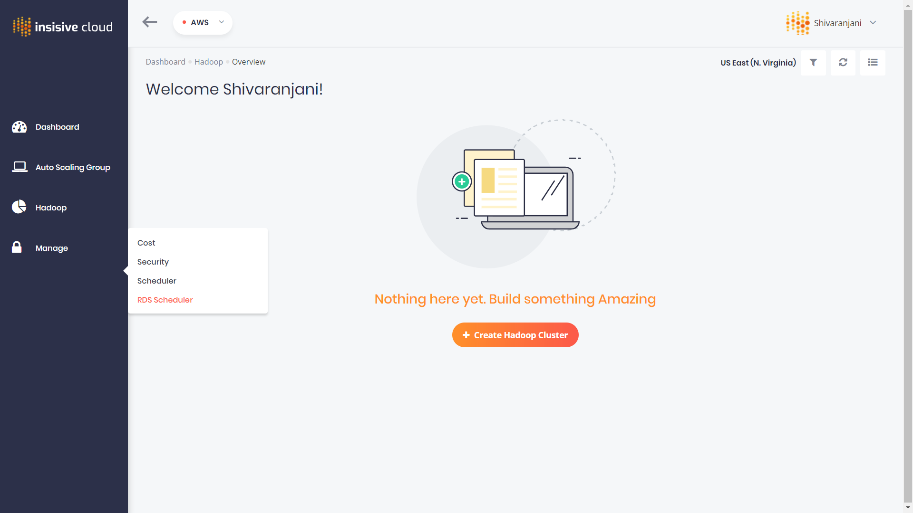

The RDS scheduler once activated, can be used to stop and restart RDS instances. For the scheduler to work the following should be specifed :
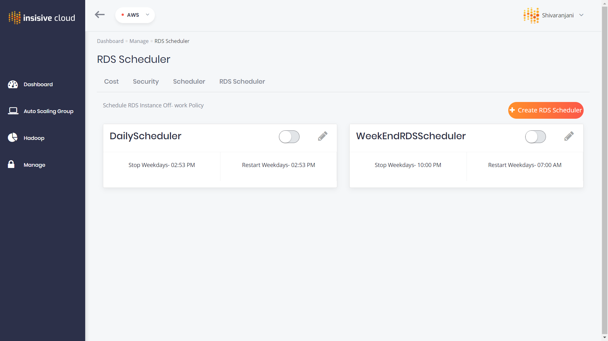
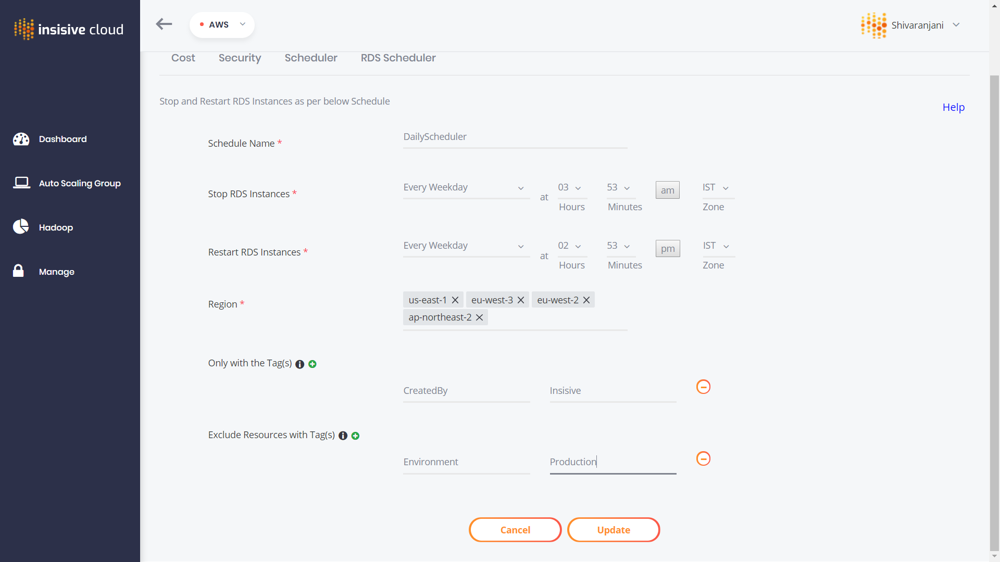
1. The stop and restart time (default being 10pm and 6am) along with the timezone (default being IST).
2. The regions across which the scheduler should be active.

Apart from the above two mandatory requirements, there is an option of including or excluding resources with specific tags available.

There are three types of schedulers :

Daily scheduler : The daily scheduler is used to stop and restart RDS instances on a daily basis according to a stipulated time specifed by the user.

Weekend scheduler : Similar to the daily scheduler, this scheduler is used to stop and restart RDS instances during the weekend.

Customisable scheduler : The customisable scheduler is similar to the above two and n-number of them can be created with varying parameters.
